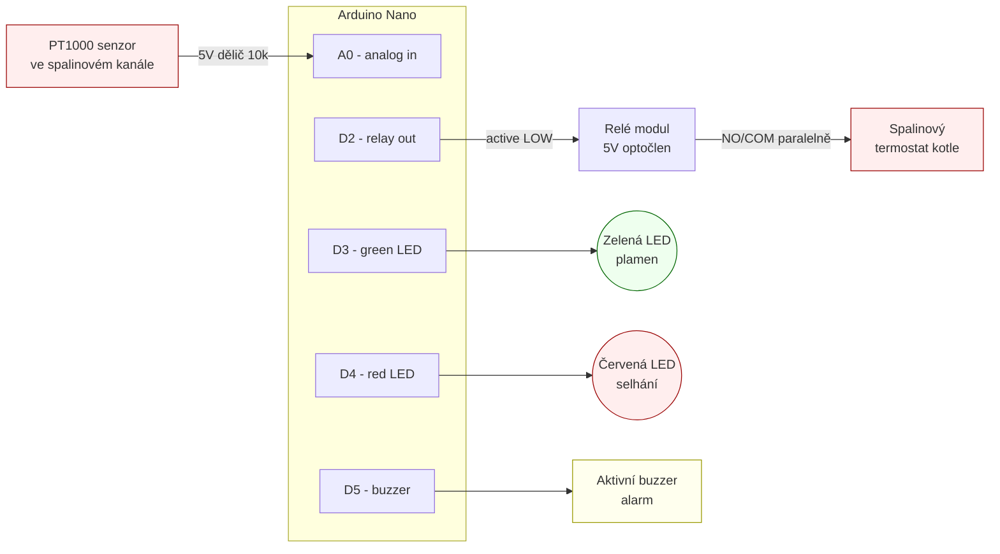

# Zapojení HeaterFlameDetection

Tenhle dokument popisuje kompletní zapojení krabičky: piny, bloky a schéma. Pro reálnou stavbu plně stačí tyhle informace — KiCad schéma a PCB návrh jsou TODO.

## Rychlá reference — piny

| Pin Nano | Funkce | Směr | Poznámka |
|---|---|---|---|
| `5V` | Napájení děliče, relé, LED, buzzer | out | Ze stabilního zdroje 5 V / ≥500 mA |
| `GND` | Společná zem | — | |
| `A0` | PT1000 — střed děliče | in (analog) | Dělič s 10 kΩ |
| `D2` | Vstup relé modulu (`IN`) | out | Active LOW |
| `D3` | Zelená LED (anoda) | out | Přes rezistor ~330 Ω |
| `D4` | Červená LED (anoda) | out | Přes rezistor ~330 Ω |
| `D5` | Aktivní buzzer (+) | out | Aktivní = má vlastní oscilátor |

Všechny nevyužité piny zůstávají volné. Sériový port (`D0`/`D1`) slouží k ladění přes Serial monitor (9600 baud).

## Bloky

### 1. PT1000 senzor spalin

Dělič napětí s 10 kΩ rezistorem. PT1000 má při pokojové teplotě ~1100 Ω, při 100 °C ~1385 Ω, při 400 °C ~2470 Ω.

```
5V ──[PT1000]──┬──[10k]── GND
               │
               └──> A0
```

**Důležité:**
- PT1000 musí být v pouzdře odolném do ~500 °C (keramika, nerez, s termovodivou pastou pro lepší kontakt).
- Kabel od PT1000 do krabičky veď pokud možno **stíněný** a co nejkratší — je to analogový signál.
- Umístění: spalinový kanál co nejblíže výstupu z kotle (před klapkou, ne za).

**Poznámka k přesnosti:** PT1000 přes dělič s 10 kΩ není nejpřesnější řešení — pro skutečně přesné měření se používá MAX31865. Pro detekci plamene to ale stačí, protože nás zajímá gradient (nárůst v čase) a hrubé prahy, ne absolutní přesnost.

### 2. Relé — přemostění spalinového termostatu

Použij hotový relé modul s optočlenem (5 V, active LOW). Typicky má svorky `VCC`, `GND`, `IN` a na druhé straně `NO` / `COM` / `NC`.

```
Nano 5V  ── VCC
Nano GND ── GND
Nano D2  ── IN

Kontakty NO + COM zapoj paralelně ke kontaktům spalinového termostatu.
Když D2 = LOW, relé sepne a termostat je přemostěn.
```

**Bezpečnost:**
- Relé modul musí mít galvanicky oddělené kontakty od řídicí strany (většina modulů to má).
- Spalinový termostat obvykle spíná ventilátor/laddomat na síťovém napětí. Kontakty relé musí unést proud ventilátoru (typicky do 1 A, ale kontroluj štítek).
- Napájení relé modulu ze stejného 5 V jako Nano. Pokud by byl ventilátor induktivní zátěž a relé jiskřilo, doplň RC snubber na kontaktech.

#### Alternativa: SSR (Solid State Relay)

Místo klasického mechanického relé je v tomhle použití často lepší volba **SSR** (např. Fotek SSR-25 DA, nebo malé moduly s Omron G3MB-202P pro DC / AC zátěž). Důvody:

- **Žádné mechanické kontakty** → prakticky neomezená životnost, pro zařízení, které v topné sezóně spíná mnohokrát denně, je to podstatný rozdíl.
- **Žádné jiskření** → nevadí induktivní zátěž ventilátoru, nehrozí přivaření kontaktů.
- **Tichý provoz** → nic nekliká, vhodné do obytného prostoru.
- **Rychlé spínání** → nerelevantní pro tuhle aplikaci, ale přijde to zdarma.

**Na co si dát pozor u SSR:**
- SSR má **polaritu** na výstupu, pokud jde o AC vs. DC typ. Pro spínání ventilátoru / laddomatu kotle potřebuješ **AC typ** (většina modulů s logem "DA" — DC řídicí vstup, AC výstup).
- Při spínání síťové zátěže potřebuje SSR **chladič** — při cca 1 A ventilátoru to není kritické, ale pro vyšší proudy je nutný.
- SSR má v sepnutém stavu **úbytek napětí** (typicky 1–1,5 V) a tedy malou klidovou ztrátu — u 1 A to je pár wattů tepla, proto ten chladič.
- Některé SSR mají **minimální zátěžový proud** (např. 100 mA) — pokud bys jím spínal jen cívku stykače, zkontroluj datasheet.
- Zapojení z Nano je triviální: `D2` → `+` vstupu SSR, `GND` → `−`. Malé SSR moduly typu G3MB-202P rovnou akceptují 3,3–5 V logiku a mají optočlen uvnitř, nepotřebují vlastní napájení.

Pro začátečníka a minimální cenu stačí klasické relé modul z aliexpressu, ale pokud chceš "zapoj a zapomeň" řešení, SSR je lepší investice.

### 3. LED indikátory

Dvě standardní 5 mm LED přes rezistory:

```
D3 ──[330Ω]──>|── GND     (zelená, anoda na D3, katoda na GND)
D4 ──[330Ω]──>|── GND     (červená)
```

Hodnota rezistoru závisí na LED — pro běžné 5 mm 20 mA LED je 330 Ω pro 5 V bezpečná volba. Pro velmi jasné LED můžeš zvětšit na 1 kΩ.

### 4. Buzzer

**Aktivní** buzzer (má vlastní oscilátor, dělá zvuk přímo po přivedení napětí). Dvouvývodový:

```
D5 ── (+) buzzer (−) ── GND
```

Pozor, **nepoužívej pasivní buzzer** — ten by potřeboval PWM signál, což aktuální kód neřeší.

Pokud chceš hlasitější alarm, můžeš buzzer nahradit piezosirénou s vlastním napájením, spínanou přes další tranzistor nebo relé.

## ASCII schéma

```
                 ┌─────────────────────────┐
                 │                         │
                 │    Arduino Nano         │
                 │                         │
   5V  ──────────┤ 5V                  A0  ├─── PT1000 dělič (5V─PT1000─┤├─10k─GND)
   GND ──────────┤ GND                     │
                 │                         │
                 │                     D2  ├─── Relé IN (modul 5V, active LOW)
                 │                         │
                 │                     D3  ├──[330Ω]──>|── GND   zelená LED
                 │                         │
                 │                     D4  ├──[330Ω]──>|── GND   červená LED
                 │                         │
                 │                     D5  ├── (+) buzzer (−) ── GND
                 │                         │
                 └─────────────────────────┘

   Relé modul:
   ┌─────────────────────┐
   │  VCC  GND  IN       │  ← řídicí strana (na Nano)
   │                     │
   │  NO   COM  NC       │  ← kontaktní strana
   └──┬────┬────┬────────┘
      │    │
      │    │       ┌─────────────────────────┐
      └────┴───────┤  Spalinový termostat    │  ← paralelně k jeho kontaktům
                   └─────────────────────────┘
```

## Blokový diagram (Mermaid)



## Napájení

Nejjednodušší varianta: USB zdroj 5 V / 1 A, propojený s Nano přes USB kabel. Napájí to celé, relé modul i LED.

Pokud chceš krabičku napájet přímo ze sítě v rozvaděči kotle, použij **izolovaný spínaný zdroj Hi-Link** 230 V AC → 5 V DC 1 A. Přivaď 5 V na pin `5V` (pozor, **ne** na `VIN` — to by vyžadovalo vyšší napětí pro vnitřní stabilizátor) a zem na `GND`.

Neodděluj zem analogové a digitální strany — u takhle malého projektu to nemá smysl.

## TODO

- [ ] KiCad schéma (`docs/schematic.kicad_sch`)
- [ ] PCB návrh (jednostranný, ruční osazení)
- [ ] Fotky reálné instalace PT1000 ve spalinovém kanále
- [ ] Fotky hotové krabičky
